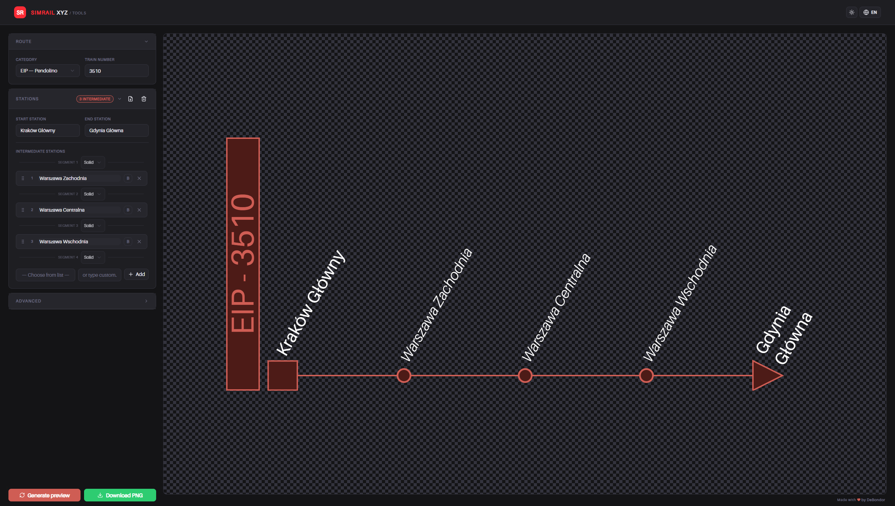

# SimRail XYZ

A set of free, open-source tools for the SimRail community, built with Next.js.



## ✨ Features

- **Route Generator:** Generate aesthetic route boards for SimRail trains with category selection, intermediate stations, segment styles, XML import, and PNG export.

- **Live Map (Soon):** Track train positions in real time on an interactive map of SimRail servers.

## 🚀 Getting Started

### Prerequisites

- [Node.js](https://nodejs.org) 18.17 or later
- npm, yarn, pnpm, or bun

### Installation

```bash
# Clone the repository
git clone https://github.com/DeBondor/simrail.xyz.git
cd simrail.xyz

# Install dependencies
npm install
```

### Development

```bash
npm run dev
```

Open [http://localhost:3000](http://localhost:3000) in your browser.

### Production Build

```bash
npm run build
npm start
```

## 🗒️ License

This project is unofficial and not affiliated with SimRail S.A. All content is provided under the [GPL-3.0 License](LICENSE).
